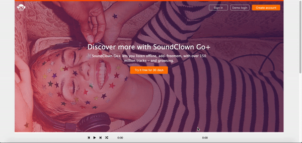

# README

[Live Demo](https://sound-cloud-pj.herokuapp.com)

SoundClown is a single-page web application that offers users to stream my favorite songs.The design and functionality is inspired by SoundCloud.

## Technologies

SoundClown is built using Ruby on Rails and a PostgreSQL database to handle the backend. AWS S3 is used to host the main media files (artist, , and album art as well as song files). React and Redux are used to manage the state of the front end alongside HTML5 and SASS for styling.

## Features

### Global music playbar

The goal:
Add the ability for users to play songs continuously while browsing the site. Allow globally synced play/pause functionality from the playbar, the song's page, and on other pages where the song appears.

The solution:
Have a UI slice of state as part of the global Redux state that keeps track of the necessary data that needs to be synced across the app. Pass the relevant parts of that slice of state and relevant actions to other components (such as the song show page) to allow for globally synced playback and control.

